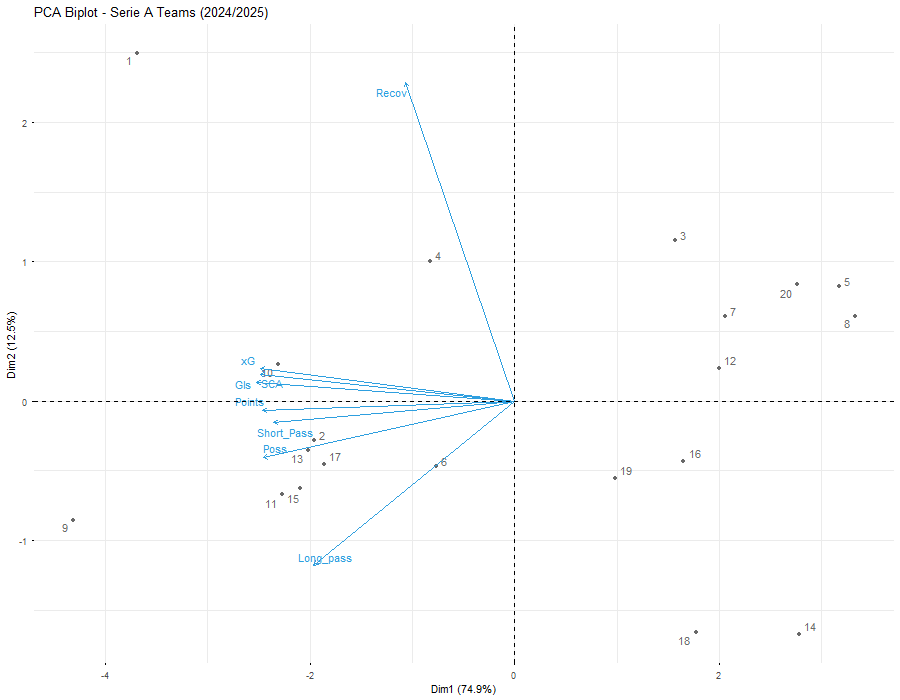
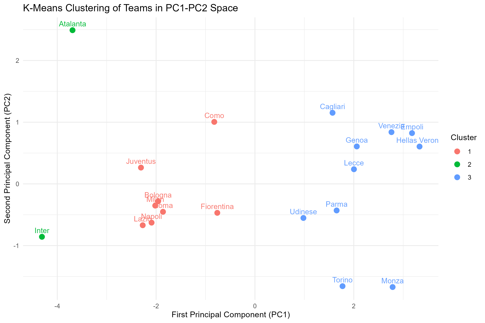

# Serie A Performance Analysis (2024/2025)

**Author:** Filippo Mercanti  
**Project for:** Computational Statistics / Data Science for Economics, Business and Finance  

## What is this project about?

For my Computational Statistics exam, I analyzed what drives success in Italian Serie A during the 2024/2025 season. 

I combined different performance metrics like Expected Goals, Shot Creation Actions, Pass completion, and Recoveries to see what actually predicts a team's **points in the table** and **goals scored**.

## What I did

1. **Collected & Cleaned Data:** Downloaded 8 datasets from FBref, cleaned team names, and merged them into a single dataframe in R.
2. **Linear Regressions:** Built multiple regression models to predict Points and Goals, checking classic assumptions (Shapiro-Wilk, Breusch-Pagan, VIF).
3. **PCA (Principal Component Analysis):** Reduced dimensions to find the main playstyle traits explaining team performance (~87% variance explained by PC1 and PC2).
4. **K-Means Clustering:** Grouped all 20 teams into 3 performance clusters.

## Project Structure

- **data/** : Original FBref CSV files
- **R/main_analysis.R** : Main R script with all data cleaning and analysis
- **output/** : Exported plots and summary comparison CSV
- **README.md** : Documentation file

## Quick Summary of Results

### Regressions
When predicting Goals scored, a model with just Expected Goals (**xG**) and Shot Creation Actions (**SCA**) reaches an $R^2 = 0.93$, performing almost as well as the full 6-variable model ($R^2 = 0.97$). This highlights that chance quality is far more impactful than raw possession.

* **Points Model (Full):** R² = 0.841 | Adj. R² = 0.768 | Predictors: 6
* **Goals Model (Full):** R² = 0.972 | Adj. R² = 0.958 | Predictors: 6
* **Goals Model (Reduced - xG + SCA):** R² = 0.930 | Adj. R² = 0.922 | Predictors: 2

## Plots

### PCA Biplot
How variables correlate and where teams land on PC1 and PC2:

### K-Means Clusters
Teams grouped into 3 tiers based on overall stats:

## How to run the code

1. Open **R/main_analysis.R** in RStudio.
2. Set your working directory to the project folder.
3. Run the script. All plots and the summary CSV will be saved in the **output/** folder.

**Packages used:** ggplot2, factoextra, lmtest, car, dplyr, readr.
